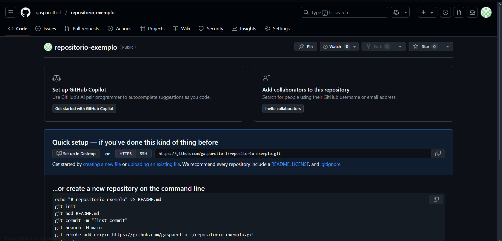
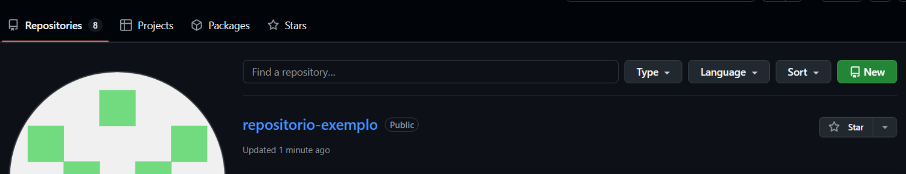
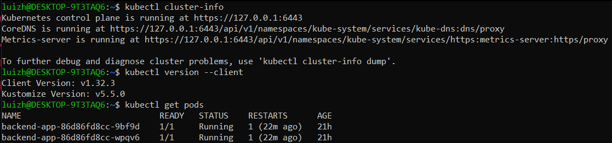
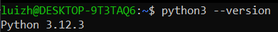
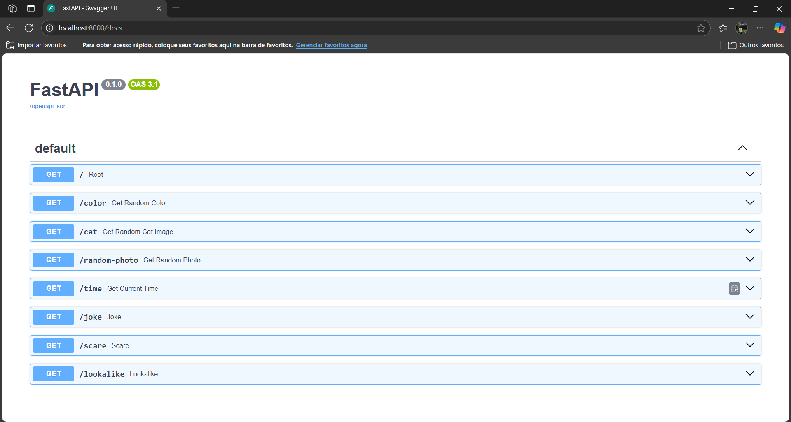

## Criação do repositorio no github

- Primeiro vamos começar criando um repositorio no github. 
- Siga as etapas abaixo:
    - Acesse https://github.com, e faça login na sua conta(caso não tenha uma conta, é preciso que crie para continuar com pratica desse repositorio).
    - Clique em <b>new</b> como na imagem para criar um novo repositorio.
    
        

    - Adicione um nome ao seu repositorio 
    - Recomendo deixa-lo vazio inicialmente para evitar erros.
    - Também deixe o repo público, caso não queira ter que configurar credenciais de segurança, quando for deployar sua aplicação.

          

    - Se tudo correr deve ver algo no como nas imagens abaixo:

          
        

## Criação da conta no Docker Hub

- Acesse hub.docker.com

- Clique em Sign up e se cadastre

    

- Siga as etapas indicadas pelo site e terá sua conta criada.


## Verificar acesso ao cluster Kubernetes local

- Antes de realizar essa etapa é necessario que tenha o kubernetes no seu pc
    - Recomendo que instale o rancher desktop, mas também pode ser o docker hub, minikube ou semelhante.

- Em seu terminal, execute os comandos abaixo para confirmar que há um cluster kubernetes localmente.
```powershell
    kubeclt cluster-info \\ 1º Comando - Info do Cluster
    kubectl --version \\ 2º Comando - Versão do Kubernetes
    kubectl get pods \\ 3º Comando - Verificando os pods
```
- Se funcionar as saidas dos comandos devem ser como as minhas:

    

- Tudo certo, cluster verificado!

## Validar execução local com uvicorn

- Primeiro clone o repositorio https://github.com/gasparotto-l/aplicacao-CICD.git 
- e Acese a pasta backend

```powershell
    git clone https://github.com/gasparotto-l/aplicacao-CICD.git
    cd backend
```

- Verifique se o python está instalado na sua maquina, se não instale-o antes de prossegir.
- Nesse projeto utilizei o python 3.13, mas podem realizar utilizando outra versão.

```powershell
    python --version
    python3 --version
```
- Saída do comando:

   

- Agora siga os comandos abaixo pra criar um ambiente virtual:
```powershell
    # Criando o Ambiente
    python3 -m venv venv
    # Ativar(Powershell)
    .\venv\Scripts\Activate.ps1
```
- Instale as depencias usando o comando abaixo:
```powershell
    pip install -r requirements.txt
```
- Execução da Aplicação 
```powershell
    python -m uvicorn main:app --reload
```

- Teste a API acessando http://localhost:8000/docs

    

- Se conseguiu acessar, então tudo certo!

---

<p align="center">
  <a href="https://github.com/gasparotto-l/CICD-Projeto-Final/tree/main/Etapas/2-Conteirnização-com-DockerHub#readme
  ">
    
  </a>
</p>

