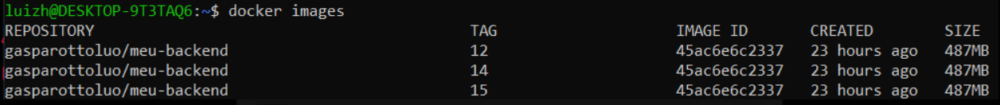
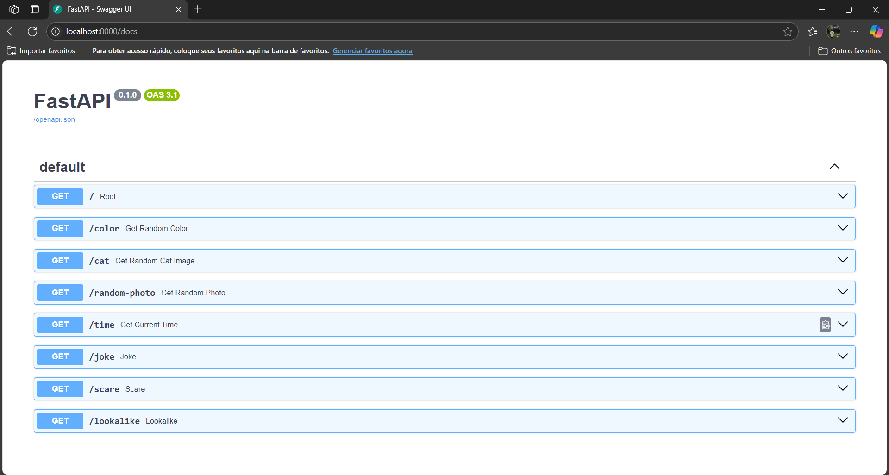
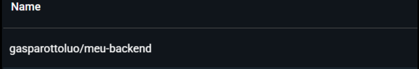

## Criação do Dockerfile

- Acesse a sua pasta backend como feito na etapa anterior
- Crie o arquivo Dockerfile, e cole essas configurações:

```powershell
FROM python:3.13-slim
WORKDIR /app

COPY requirements.txt .
RUN pip install --no-cache-dir -r requirements.txt

COPY . .
EXPOSE 8000

CMD ["uvicorn", "main:app", "--host", "0.0.0.0", "--port", "8000"]
```

- Agora crie também um docker-compose.yaml

```powershell
version: "3.8"  
    services:
    backend:
        build:
        context: ./backend
        dockerfile: Dockerfile
        ports:
        - "8000:8000"
        container_name: meu-backend
        restart: unless-stopped
        networks:
        - app-network

    networks:
    app-network:
        driver: bridge
```
## Construindo a Imagem

- Construa a imagem utilizando o docker compose:

```powershell
    docker-compose build
```

- Verifique se as imagens foram criadas 
```powershell
    docker images
```
- Saida do comando:
    
    

## Executando a Imagem

- Faça a execução utilizando o docker compose e verifique os conteiners rodando.

```powershell
    # Suba a aplicação
    docker-compose up -d
    # Verifique os conteineres
    docker ps
```

- Acesse no navegador http://localhost:8000/docs

    

## Publicando a imagem no Docker Hub
- Faça o login na sua conta do docker usando o comando abaixo:

```powershell
    docker login -u <username>
```

- Adicione tags e faça o push para o docker 

```powershell
    docker tag aplicacao-CICD-backend gasparottoluo/meu-backend:latest
    docker push gasparottoluo/meu-backend:latest
```


- Se conseguiu realizar isso, então tudo certo!


