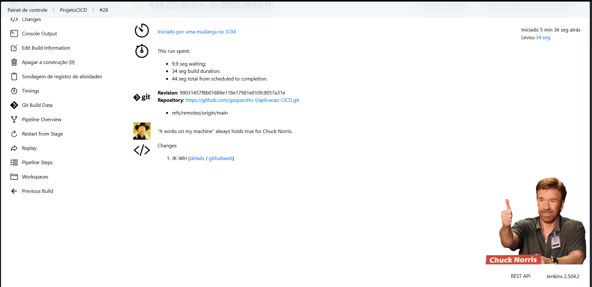
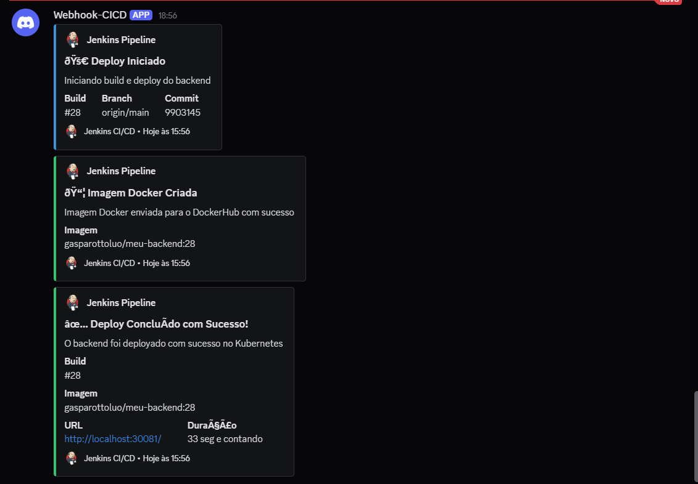

# Plugin Chuck Norris - Jenkins 🥋

### Instalar Plugin
1. Acesse **Jenkins Dashboard**
2. Vá em **Gerenciar Jenkins** → **Gerenciar Plugins**
3. Na aba **Disponíveis**, busque por `Chuck Norris`
4. Marque a checkbox e clique em **Instalar sem reiniciar**
5. Aguarde a instalação concluir

- Como mostrado na imagem abaixo:


### Configurar no Pipeline
Adicione a função `chuckNorris()` no bloco `post` do seu Jenkinsfile:

```groovy
pipeline {
    agent any
    
    stages {
        stage('Build') {
            steps {
                echo 'Fazendo build...'
            }
        }
        stage('Test') {
            steps {
                echo 'Executando testes...'
            }
        }
        stage('Deploy') {
            steps {
                echo 'Fazendo deploy...'
            }
        }
    }
    
    post {
        always {
            // Plugin Chuck Norris - Motivação extra! 🥋
            chuckNorris()
        }
        success {
            echo '✅ Pipeline executado com sucesso!'
        }
        failure {
            echo '❌ Pipeline falhou!'
        }
    }
}
```

## Resultado Visual

Após a execução do pipeline, você verá:
- 🖼️ **Imagem do Chuck Norris** na página do build
- 💬 **Frase motivacional** aleatória
- 🎯 **Seção dedicada** "Chuck Norris" no histórico do build


## Implementação no Projeto

### Localização Recomendada
Coloque `chuckNorris()` no bloco `post → always` para garantir que sempre execute:

```groovy
post {
    always {
        chuckNorris()
        
        // Outras ações de limpeza
        script {
            // Restaurar arquivos, etc.
        }
    }
}
```
## Exemplos praticos:
#### - Imagens do chuck norris sendo executado:
 
 


## Integração Discord Webhook - Jenkins Pipeline

## Configurações Necessarias
1. Instalar plugin **HTTP Request** no Jenkins
2. Criar webhook no Discord (Servidor → Integrações → Webhooks)
3. Substituir `SEU_WEBHOOK_URL_AQUI` pela URL real
4. Pipeline funcionará automaticamente

### Variável de Ambiente
- Adicione a variavel de ambiente com o url do seu webhook.
```groovy
environment {
    DISCORD_WEBHOOK_URL = "SEU_WEBHOOK_URL_AQUI"
}
```

### Novo Stage de Notificação
- **Stage**: "Notificar Início" 
- **Função**: Envia notificação quando pipeline inicia
- **Cor**: Azul (3447003)

### Notificação no Push Docker
- Confirma quando imagem é enviada ao DockerHub
- **Cor**: Verde (3066993)

### Notificações no Post
- **Success**: Deploy concluído ✅
- **Failure**: Erro no processo ❌  
- **Unstable**: Build com problemas ⚠️

## Função Principal

#### `sendDiscordNotification()`
```groovy
def sendDiscordNotification(Map config) {
    // Monta payload com embeds do Discord
    // Usa httpRequest para enviar via POST
    // Trata erros 
}
```

**Parâmetros:**
- `title`: Título da notificação
- `description`: Descrição do evento
- `color`: Cor da borda (decimal)
- `fields`: Campos adicionais (array)

## Informações Enviadas
- Build ID e número
- Branch e commit (quando disponível)
- Nome da imagem Docker
- URL do serviço
- Duração do build
- Links para Jenkins

## Webhook na pratica



- #### Podemos ver:
1. O deploy iniciado.
2. Criação da imagem
3. A conclusão do deploy

- Importante destacar que os erros de linguagem podem ocorrer por conta de alguns caracteres especias da lingua portuguesa, nada anormal. 
    - Como usar **ç** em algum codigo, imagino que sabia o problema que pode enfrentar.

---