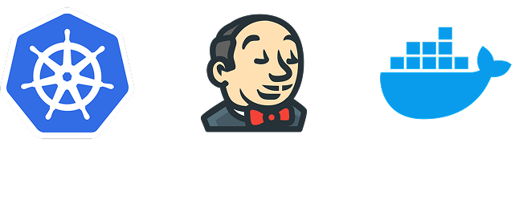

  

# Projeto-Final-DevOps

## Info
- Autor: Luiz H. Gasparotto
- Data: Entre 09/06 e 00/00
- Tipo: Academico/Trabalho

## Tecnologias Utilizadas
- FastAPI: Framework web em Python.
- Docker: Para conteinerização da aplicação.
- Docker Hub: Registro público de imagens.
- Jenkins: Ferramenta de CI/CD.
- Kubernetes local: Rancher Desktop

## Descrição do Projeto

- Este projeto tem como objetivo ensinar na prática os conceitos de CI/CD
utilizando as tecnologias FastAPI, Docker, Jenkins e Kubernetes. Os bolsistas
trabalharão com um código base em FastAPI e desenvolverão uma esteira de
automação que fará o deploy automatizado da aplicação em um cluster
Kubernetes local.

## Súmario do Projeto:

- [1-Preparação-do-Projeto](1-Preparação-do-Projeto)
  - [ ] Criar um repositório de código no Github para inserir a aplicação de exemplo.
  - [ ] Criar conta no Docker Hub.
  - [ ] Verificar acesso ao cluster Kubernetes local.
  - [ ] Validar execução local com uvicorn.    
- [2-Conteirnização-com-DockerHub](2-Conteirnização-com-DockerHub)
  - [ ] Criar o dockerfile;
  - [ ] Fazer build: docker build -t usuario/fastapi-hello:latest .
  - [ ] Fazer push: docker push usuario/fastapi-hello:latest
  - [ ] Versionar o dockerfile junto com o código da aplicação no github.

- [3-Arquivos-de-Deploy-no-Kubernetes](3-Arquivos-de-Deploy-no-Kubernetes)
  - [ ] Criar o yaml de deployment da aplicação e aplicá-lo no cluster
  - [ ] Criar o yaml de service do deploymento e aplicá-lo no cluster
- [4-Jenkins-Build-e-Push](4-Jenkins-Build-e-Push)
  - [ ] Criar a pipeline no Jenkins
  - [ ] Realizar o stage de build
  - [ ] Realizar o stage de push
- [5-Jenkins-Deploy-no-Kubernetes](5-Jenkins-Deploy-no-Kubernetes)
  - [ ] Jenkins precisa acessar o kubectl (usar agent com kubectl e kubeconfig
configurados);
  - [ ] Adicionar etapa de deploy no Jenkinsfile
  - [ ] Testar a pipeline completa

- [6-Extras](6-Extras)
  - [ ] Criar uma etapa após o push da imagem de container, realizar o scanner
de vulnerabilidades, utilizando o Trivy.
  - [ ] Criar um webhook com o Slack ou Discord para avisar quando a pipeline
for atualizar no ambiente Kubernetes.
  - [ ] Subir o Sonarqube em ambiente Docker e conectá-lo com o Jenkins e
enviar todo o código da aplicação para a análise SAST.
  - [ ] Utilizar Helm Chart para implantar a aplicação no Kubernetes.
     
- [7-Considerações-Finais](7-Considerações-Finais)
  - Testes realizados
  - Erros encontrados e possiveis soluções
  - Conclusão do projeto
## Agradecimentos
- Agradeço profundamente que possa prestigiar meu projeto dando um pouco da sua atenção, é muito importante pra mim.
- Se notar quaisquer que sejam os erros ou possiveis melhorias, entre em contato comigo, estarei a disposição para fazer mudanças.

---

  

